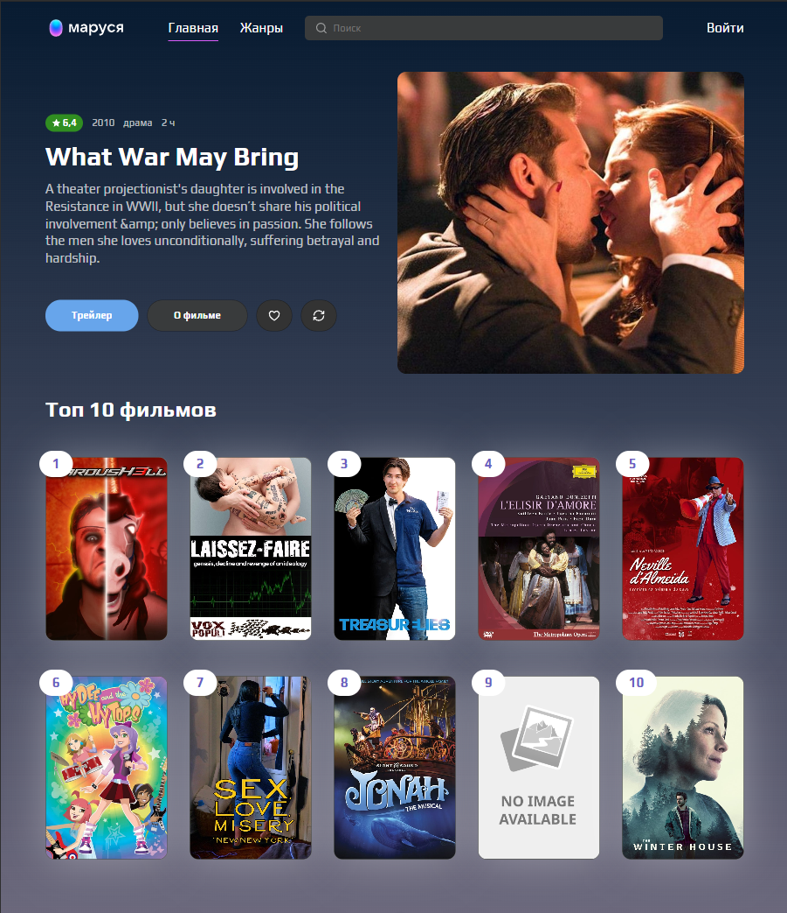
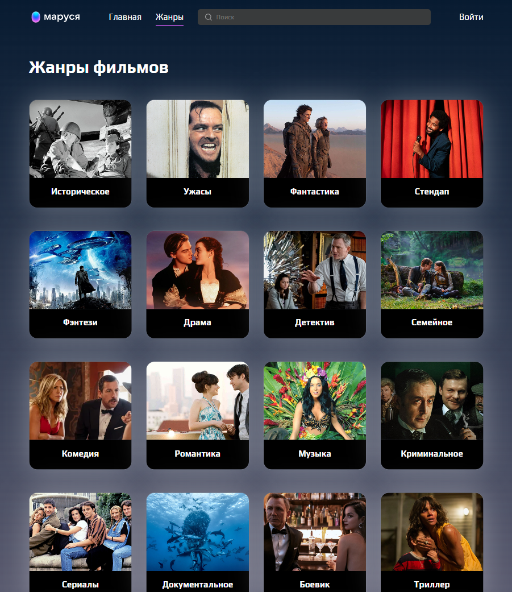
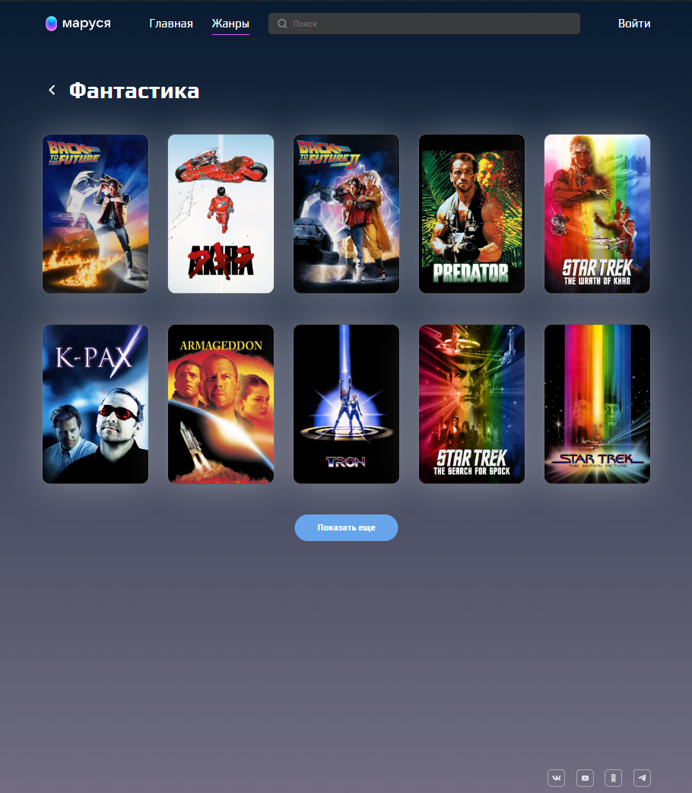
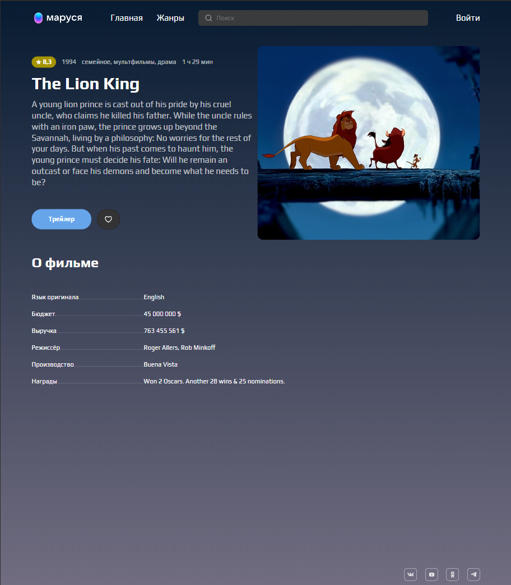
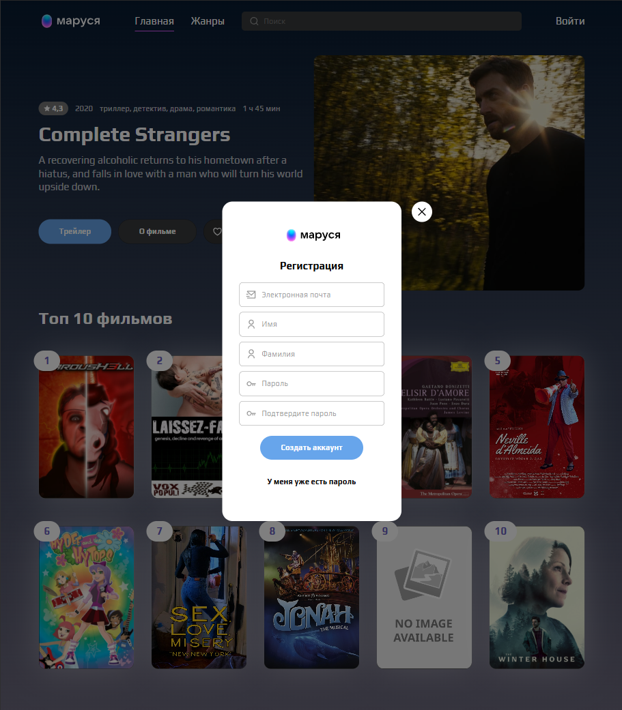
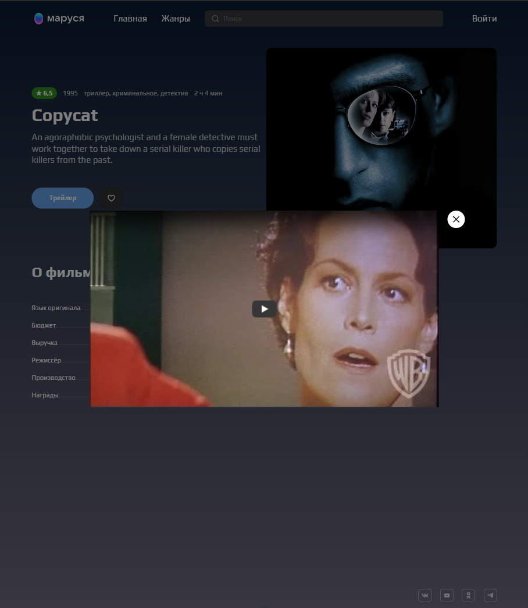
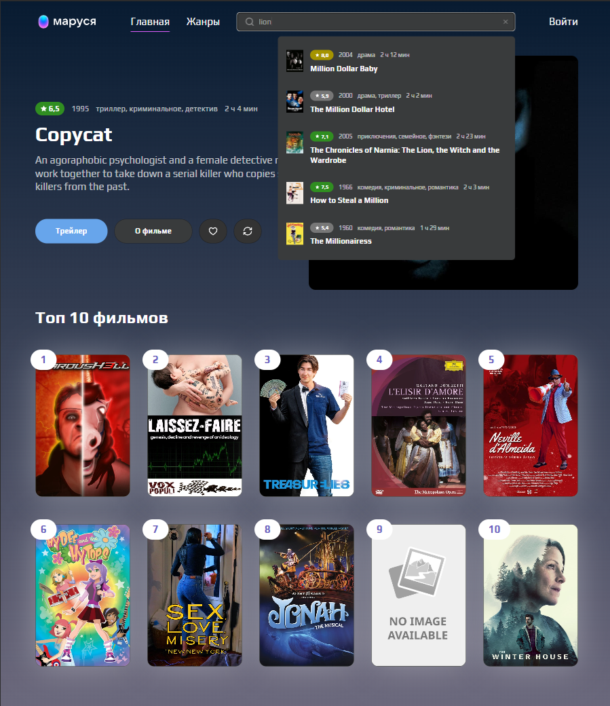
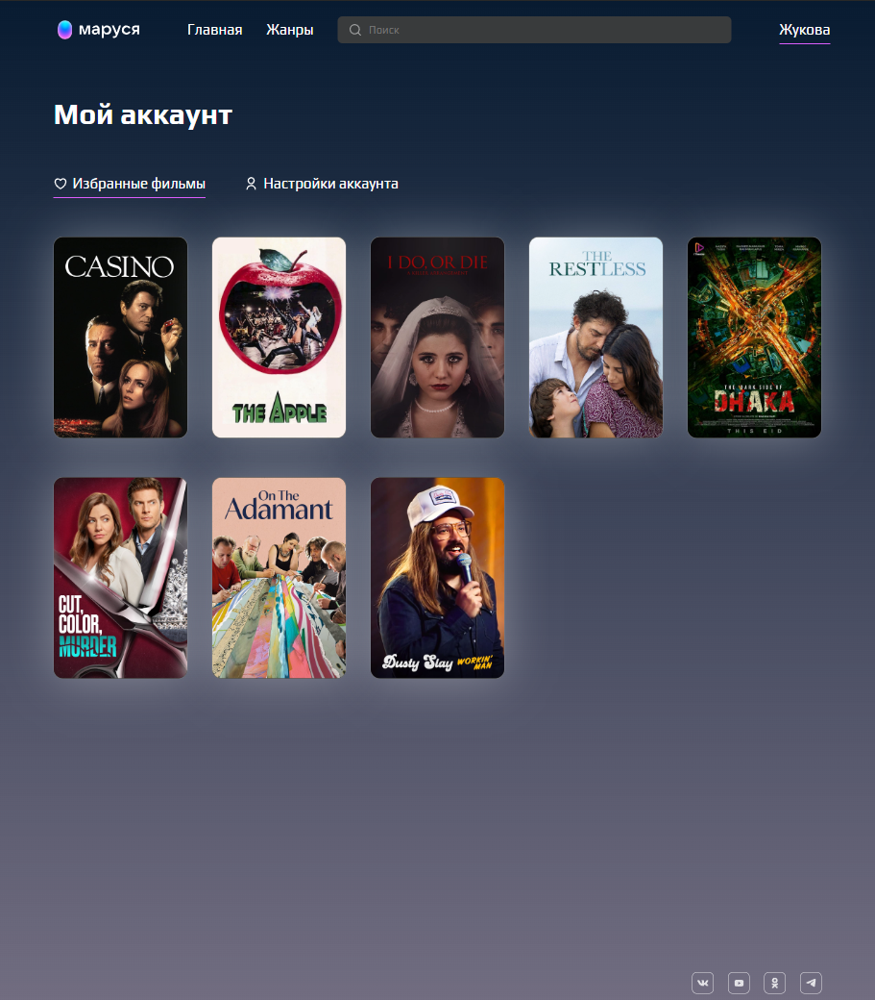

# VK Маруся — Онлайн-платформа для поиска фильмов

## Описание проекта

VK Маруся — это одностраничное веб-приложение (SPA), представляющее собой бета-версию онлайн-платформы для поиска фильмов, просмотра трейлеров и управления избранными фильмами.

Пользователи могут искать фильмы, фильтровать их по жанрам, смотреть трейлеры и сохранять любимые картины в «Избранное».

## Основной функционал

- **Поиск фильмов по названию**
- **Просмотр случайного фильма**
- **Добавление/удаление фильмов из избранного**
- **Просмотр трейлеров**
- **Просмотр фильмов по жанрам**
- **Авторизация и регистрация пользователей**
- **Страница аккаунта с личными данными и списком избранных фильмов**

Для работы требуется запущенный backend (см. папку `backend/`).

## Скриншоты страниц











## Стек технологий

- **Vue 3 + TypeScript**
- **Pinia** - управление состоянием
- **Vue Router** - маршрутизация
- **SASS/SCSS** - стилизация
- **Vite** - сборка проекта
- **ESLint, Prettier, Stylelint** - линтинг и форматирование кода
- **Swiper.js** - слайдер на мобильных устройствах

## Установка и сборка проекта

1. **Клонируйте репозиторий и перейдите в папку проекта:**

   ```
   $ git clone <адрес-репозитория>
   $ cd <папка-проекта>
   ```

2. **Установите зависимости:**

   ```
   $ npm install
   ```

3. **Запуск dev-сервера с автоматическим открытием браузера:**

   ```
   $ npm run dev
   ```

   Проект будет собран в режиме разработки, приложение будет запущено по адресу [http://localhost:5173](http://localhost:5173).

4. **Сборка для продакшена:**

   ```
   $ npm run build
   ```

   Результат сборки появится в папке `dist/`.

5. **Предпросмотр собранного проекта:**

   ```
   $ npm run preview
   ```

## Работа с API

Для получения данных о фильмах, жанрах и пользователя используется публичное API: [https://cinemaguide.skillbox.cc/docs/]https://cinemaguide.skillbox.cc/docs/

**Ключевые эндпоинты:**

- **/api/movie** — получение фильма
- **/api/movie/genres** — получение списка жанров
- **/api/auth/login** и **/api/user** — авторизация и регистрация
- **/api/profile** — получение данных пользователя
- **/api/favorites** — получение избранных фильмов

Авторизация происходит через cookie-сессии.

## Основные страницы

- **Главная**(/) — случайный фильм + топ-10 по IMDb
- **Жанры**(/genres) — список жанров фильмов
- **Фильмы по жанру**(/genres/:genre) — фильмы для жанра
- **Карточка фильма**(/films/:id) — описание, трейлер, добавление в избранное
- **Аккаунт**(/account) — личная информация и список избранных фильмов
- **Авторизация / регистрация (модальные окна)**

## Проверка качества кода

- **Форматирование и линтинг стилей:**
  - Настройки в `.prettierrc.json` и `.stylelintrc.cjs`

---
